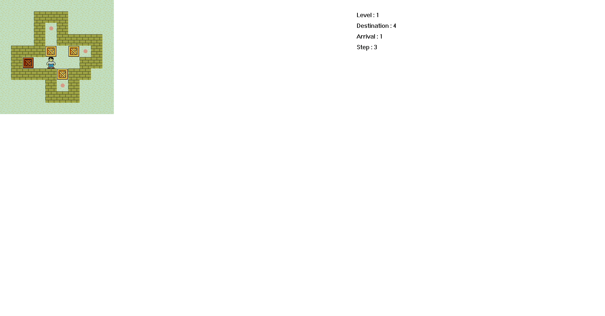
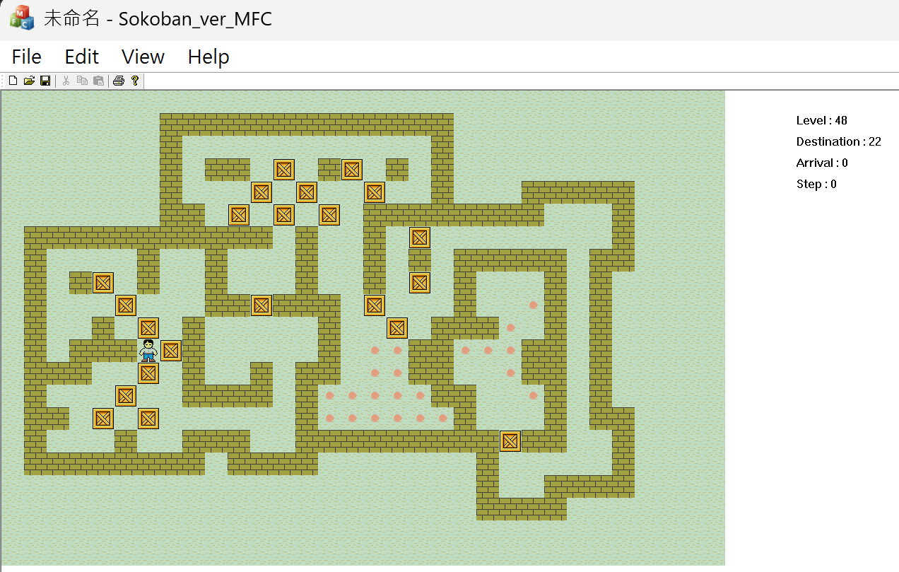
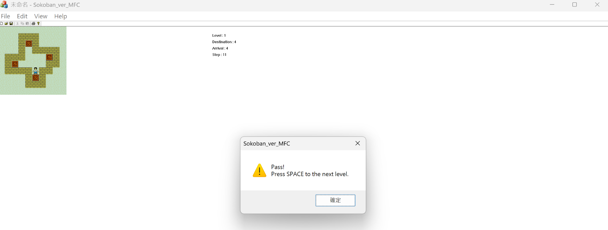

# Sokoban-MFC

A Sokoban (推箱子) puzzle game built in **C++** with a **Windows MFC GUI**, featuring **151 levels**, smooth rendering, and a clean separation between **UI** and **game logic**.

以 C++/MFC 製作的 Windows 桌面推箱子遊戲，包含 151 關，並將遊戲邏輯與 UI 分層，方便維護與擴充。

---

## Gameplay
控制角色推動箱子到指定位置；箱子只能被推動（不可拉動），需規劃路徑避免卡死。



---

## Game Preview

### 遊戲畫面


### 過關提示



---

## HUD（右上角資訊顯示）

遊戲右上角會顯示目前關卡狀態，共有四項：

| 名稱 | 說明 |
|------|------|
| **Level** | 到達的關卡數（目前正在遊玩的關卡編號）。 |
| **Destination** | 此關卡中有幾個終點（目的地）。 |
| **Arrival** | 已經有幾個箱子成功放入終點。 |
| **Step** | 玩家目前累積的移動步數。 |

### 過關條件  
當 **Arrival == Destination** → 顯示過關訊息並按 **Space** 進入下一關。

---

## Features

### 完整的推箱子遊戲邏輯  
- 支援 **151 個關卡**（`map000` ~ `map150`）  
- 元件支援：
  - Wall（牆）
  - Box（箱子）
  - Destination（目的地）
  - Arrival（箱子在目的地）
  - Worker（工人）
  - Blank（空白）

### MFC 圖形介面  
- 使用 `BitBlt()` 將 **32×32 BMP 圖片**畫在遊戲視窗  
- 資料由 Document 層管理  
- 由 View 層負責繪製與事件處理（鍵盤輸入）

### 支援多種鍵盤操作  
- WASD / HJKL / 方向鍵皆可操作  
- 可以切換關卡、重新開始、上一關、下一關  

### 過關判定與提示
當所有箱子都放在目的地 → 顯示過關訊息，按 **Space** 進入下一關。

---

## Controls

| Key                | Function            |
|--------------------|---------------------|
| **W / ↑**          | Move Up            |
| **S / ↓**          | Move Down          |
| **A / ←**          | Move Left          |
| **D / →**          | Move Right         |
| **H / J / K / L**  | Vi-style movement  |
| **R**              | Restart level      |
| **P / PageDown**   | Next level         |
| **O / PageUp**     | Previous level     |
| **Space**          | Go to next level when cleared |

---

## Project Structure

```text
Sokoban-MFC/
│
├─ BMP/                     # All bitmap graphics (wall, box, dest, worker…)
│     arrival.bmp
│     blank.bmp
│     box.bmp
│     destination.bmp
│     wall.bmp
│     worker.bmp
│
├─ Map/                     # 151 map files (map000 ~ map150)
│     map000
│     map001
│     ...
│     map150
│
├─ src/
│     Coordinate.cpp/.h        # Coordinate struct/class
│     framework.h              # MFC framework include
│     MainFrm.cpp/.h           # Main window frame
│     pch.cpp/.h               # Precompiled headers
│     resource.h               # Resource definitions
│     targetver.h              # Windows target configuration
│
│     Sokoban_ver_MFC.cpp      # Application class
│     Sokoban_ver_MFCDoc.cpp   # Game logic (map loading, movement)
│     Sokoban_ver_MFCView.cpp  # Rendering + keyboard control
│     Sokobanver_MFC.rc        # Resource script
│     Sokobanver_MFC.aps       # Resource cache (optional)
│     Sokoban_ver_MFC.vcxproj
│     Sokoban_ver_MFC.vcxproj.filters
│
└── Sokoban_ver_MFC.sln        # Visual Studio solution file
